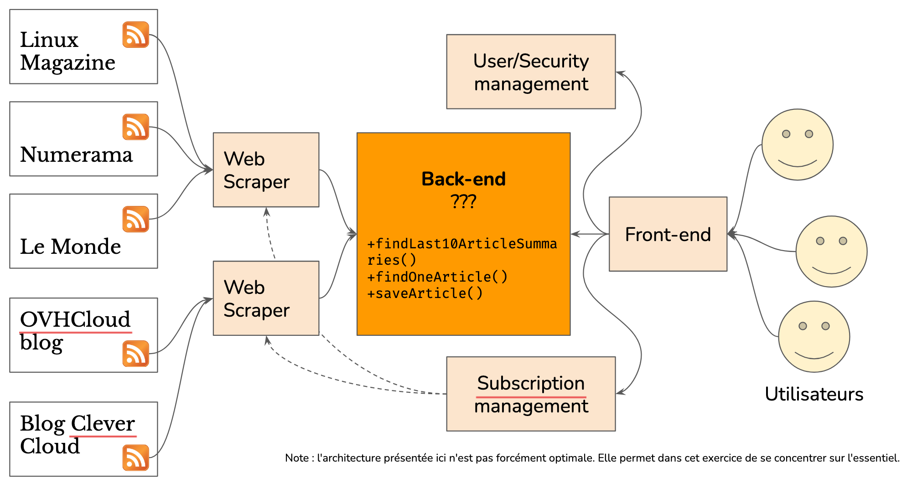

# Project: RSS feed aggregator

## Introduction
The project consists in the creation of the back-end of an RSS feed aggregator. The goal is to create an application able to gather in one place articles from different websites to which a user has subscribed.

To do this, we will use the RSS (Really Simple Syndication) format, a data format derived from XML, which allows websites to offer a summarized information flow, containing the latest published articles. Our application will therefore use Web Scrapers to retrieve articles from the various sites to which users have subscribed and store them in a database.


## What is an RSS feed aggregator?
An RSS aggregator is a tool that allows you to gather content from different sources in one place, usually in the form of syndication feeds. RSS (Really Simple Syndication) feeds are XML file formats used to disseminate real-time information on the web, such as article titles, summaries or links to complete content.

An RSS feed aggregator allows the user to subscribe to multiple content sources at the same time and view them from a single interface. This saves time by avoiding the need to navigate through several different sites to find the information they are looking for. RSS feed aggregators are commonly used to follow news, blogs, podcasts, videos, etc.

RSS aggregators can be web applications or software installed on a computer or mobile device. They can be customized according to the user's preferences, such as selecting specific content sources, setting filters or categorizing feeds.




## Description of the project
The project aims to develop an RSS feed aggregator capable of retrieving the latest news and information from various online sources, storing them in a database, processing them continuously and distributing them in real time. The goal is to allow users to easily access a wide variety of information in one place, without having to visit multiple websites.

The RSS feed aggregator will be designed for a broad target audience, including news professionals, journalists, academics, researchers, students, and anyone interested in news and information. The main objective is to provide a reference platform for online news consumption.

The project also aims to optimize the processing and dissemination of information in real time, using state-of-the-art technologies such as Apache Kafka and Cassandra. This will allow for efficient management of real-time data flows, storage and rapid dissemination to end users.

Ultimately, the goal is to develop a robust and powerful solution for aggregating RSS feeds, capable of providing a quality user experience with a wide variety of sources and real-time updating. The project will be developed with a modular architecture, allowing easy scalability according to future needs and technological evolutions.


## Project information
- Project contributor: Antonin, Sebastien, Antoine, Joaquim, Islaan, Adam et Yannis.
- Date of last update: April 06, 2023

## Project on Git
The project is available on the site [Github](https://github.com/) on the link : [https://github.com/antoningr/agregateur_de_flux_RSS](https://github.com/antoningr/agregateur_de_flux_RSS). 


## Downloading the project
- Open your terminal or command prompt.
- Go to the directory where you want to save the project.
- Type the following command to clone the project from the Git repository:
```
git clone https://github.com/antoningr/agregateur_de_flux_RSS.git
```
- Press "Enter" to run the command. Git will then download the project to the current directory.
